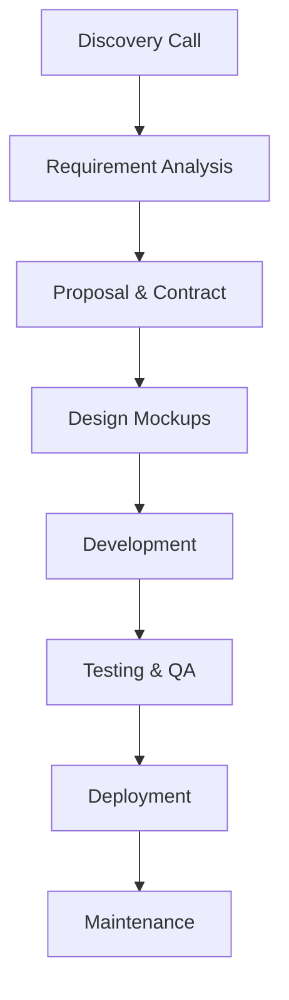

# 🌐 WebDev Duo | Freelance Web Development Team

  

👋 **Hello World!** We're **WebDev Duo** — your digital craftsmen specializing in bespoke web solutions that combine aesthetic elegance with technical excellence.

---

## 🎯 Our Mission

> *"To transform ideas into digital realities that drive business growth and deliver exceptional user experiences."*

As two passionate Computer Engineering students, we bridge the gap between academic knowledge and real-world application through:

- 💻 **Full-stack development expertise**
- 🎨 **Pixel-perfect design sensibility**
- 🚀 **Performance-optimized solutions**
- 🤝 **Client-focused collaboration**

---

## 🛠️ Our Services

### 🌈 Frontend Development

| Service               | Technologies                     |
|-----------------------|----------------------------------|
| Responsive Websites   | HTML5, CSS3, JavaScript, React   |
| Web Applications      | Next.js, Tailwind CSS            |
| UI/UX Design          | Figma, Adobe XD                  |

### ⚙️ Backend Development

| Service               | Technologies                     |
|-----------------------|----------------------------------|
| API Development       | Node.js, Express                 |
| Database Solutions    | MongoDB, MySQL                   |
| System Architecture   | RESTful APIs, Microservices      |

### ✨ Specializations
- 🛒 E-commerce Solutions
- 💬 Real-time Applications
- 📊 Business Web Portals
- 🔄 Legacy System Modernization

---

## 🚀 Featured Projects

### 🛍️ ShopNest E-Commerce Platform

**Tech Stack:** MERN Stack (MongoDB, Express, React, Node.js)

---

### ⚡ Real-Time Chat Application

**Tech Stack:** Socket.io, React, Node.js

---

## 💼 Why Choose Us?

✔ **Rapid Prototyping** - From concept to MVP in record time  
✔ **Transparent Process** - Regular updates and collaborative approach  
✔ **Future-proof Code** - Scalable architectures with clean documentation  
✔ **Student Advantage** - Fresh perspectives with academic rigor  

---

## 📈 Our Workflow

## 📞 Get In Touch

Ready to discuss your project? We'd love to hear from you!

📧 **Email:** [webdevduo@gmail.com](mailto:webdevduo@gmail.com)  
📱 **Phone:** [+91 85919 62805](tel:+918591962805)
